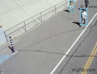
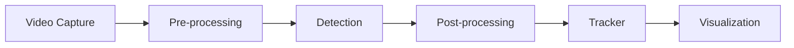

# General Object Tracker

## 1.0 Goal

Real-time object detection and tracking pipeline using C++.
Combines YOLOv10n (detection) with ByteTrack (multi-object tracking).



## 2.0 Architecture

Each frame moves through six stages, one class per stage:




| Stage | File | Class |
|---|---|---|
| Video Capture | `camera.hpp` | `WebcamCamera` / `VideoFile` |
| Pre-processing | `detector.hpp` (`preprocess_frames_`) | `YOLOv10DetectorONNX` |
| Detection | `engine.hpp` | `InferenceEngine` |
| Post-processing | `detector.hpp` (`postprocess_frames_`) | `YOLOv10DetectorONNX` |
| Tracker | `tracker.hpp` | `ByteTrackerAdapter` |
| Visualization | `visualization.hpp` | `Visualizer` |

`main.cpp` wires these together in a single loop. Every stage returns `Status::Result<T>` (`common/status.hpp`)
instead of throwing on ordinary failure, a `Recoverable` error is re-tried (`common/retry_monitor.hpp`) before it escalates to
`Fatal` and the loop exits. `ConsoleReporter` (`reporting.hpp`) prints the diagonistics in case of failure.

## 3.0 Performance

Per stage timing is printed on exit.

Sample run, YOLOv10n, CPU inference (ONNX Runtime CPU), 734 frames
from `data/input/Pedestrian_Sample_Video.mp4` (640x360), on an AMD Ryzen 7 PRO 7730U:

| Stage         | Avg ms/frame |
|---------------|-------------:|
| Source        |        0.443 |
| Preprocess    |       19.659 |
| Inference     |       59.279 |
| Postprocess   |        0.002 |
| Tracking      |        0.038 |
| Visualization |        0.658 |
| **Total**     |   **80.079** |

Approx throughput: 12.49 FPS.

## 4.0 Setup

Check all the Dependencies and the build recipe at:
- System packages → [`.devcontainer/apt-packages.txt`](.devcontainer/apt-packages.txt)
- Build recipe → [`CMakePresets.json`](CMakePresets.json)

### Step 1 - Prerequisites

- A connected camera (default device id 0; change the argument passed to `WebcamCamera` in `src/main.cpp` to select a different camera device index).
- Linux host. (The dev container also works on macOS/Windows via Docker Desktop, though camera + display passthrough are Linux-tested only.)
- Either **Docker + VS Code Dev Containers extension** (for Step 2A), *or* `sudo` on the host (for Step 2B).

The YOLOv10 ONNX model is fetched automatically by both setup paths - no manual download.

### Step 2A - Dev container (recommended)

Reproducible environment with the toolchain and dependencies pre-installed.

1. Allow the container to reach your X server (once per host boot):
   ```bash
   xhost +local:
   ```
2. Open the repo in VS Code → **Dev Containers: Reopen in Container**. First build compiles the image and runs [`post-create.sh`](.devcontainer/post-create.sh), which downloads ONNX Runtime and the YOLOv10n model (~9 MB).
3. Continue with **Step 3 - Build** inside the container terminal.

The container mounts `/dev/video0` and the X11 socket, so the OpenCV preview window and webcam work out of the box. If your camera is on a different device node (e.g. `/dev/video2`), edit `runArgs` in [`.devcontainer/devcontainer.json`](.devcontainer/devcontainer.json).

### Step 2B - Local install (Linux, alternative)

The setup script installs apt deps, pulls ONNX Runtime into `/opt/onnxruntime`, fetches the model, **and runs the initial build for you**:

```bash
./scripts/local_setup.sh
```

The script writes `scripts/local_env.sh`. **Source it in every new shell** before building or running - it points the compiler and loader at ONNX Runtime:

```bash
source scripts/local_env.sh
```

If the script's initial build succeeded, you can skip Step 3 the first time and go straight to Step 4.

### Step 3 - Build

Configure and build using the preset defined in [`CMakePresets.json`](CMakePresets.json):

```bash
cmake --preset dev
cmake --build --preset dev
```

This works identically in the dev container (Step 2A) and on a local install (Step 2B, after sourcing `local_env.sh`).

### Step 4 - Run

From the repo root (asset paths are relative to CWD):

```bash
./build-ninja/obj_tracker_cpp
```

### Tests

Five test binaries are built by default with the `dev` preset (the `release` preset disables all of them):

```bash
./build-ninja/test_camera
./build-ninja/test_detector
./build-ninja/test_reporting
./build-ninja/test_retry_monitor
./build-ninja/test_visualizer
```

The test expects `data/input/horse.jpg` and the YOLOv10n ONNX model at the paths defined in the test file.

### Controls

| Key | Action |
|-----|--------|
| `q` / `ESC` | Quit |

## TODOs

- Add a capture timestamp to `Data::Frame` (`steady_clock`)
- Wrap the detector into a ROS2 node
- Implement multi-threading
- Add a command line parser for changing runtime configs

## 5.0 References
- [ByteTrack C++ Implementation](https://github.com/Vertical-Beach/ByteTrack-cpp/tree/main)
- [YOLOv10 ONNX model](https://huggingface.co/onnx-community/yolov10n)

